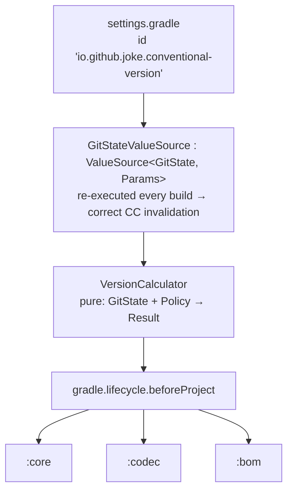
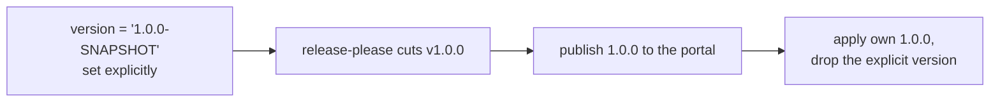

## Context

See `proposal.md` — Why. The constraints that shape the approach:

- **Isolated projects forbids cross-project model access**, so a project-level plugin would have to
  read git once per project — the same answer computed N times with nowhere to share it. Gradle's
  sanctioned replacement for `allprojects` is `Settings.getGradle().lifecycle().beforeProject { }`,
  which only a settings plugin can reach.
- **The configuration cache stores whatever configuration computes.** Anything that shells out to
  git during configuration and is not modelled as an external input gets baked into the cache entry
  and goes stale — the build then publishes a version derived from an older commit.
- **Publishing plugins read `project.version` during configuration**, so the version must be resolved
  by the time build files are evaluated, not deferred to execution.
- **`release-please` is the release authority.** Its notion of "the last release" is a GitHub
  Release, not a git ref. `testing-release-please` demonstrates the gap concretely: hand-created tags
  `v5.5.5`–`v5.5.7` sit above `v1.3.0` in history, and release-please still computed `1.4.0`.
- **The plugin is consumed by other people's builds**, so its buildscript classpath footprint is part
  of its public contract.

## Goals / Non-Goals

**Goals:**

- One git read per build invocation, correct under both the configuration cache and isolated
  projects, with invalidation that works rather than a cache that must be manually cleared.
- A calculation core that is a pure function of repository facts, testable exhaustively without a
  Gradle daemon.
- Zero libraries on the consumer's buildscript classpath.
- Every input that changes the number is named after its `release-please` counterpart, so a
  divergence between the two configurations is greppable.

**Non-Goals:**

- Pre-release stages (`alpha`, `beta`, `rc`). `release-please` supports them; nothing here needs them
  and inventing a policy without a consumer would be guesswork.
- Per-module versions derived from commit scopes. The scope is captured (see Decisions) but the
  calculation collapses to a single version.
- Supporting `release-please` manifest mode / multi-package repositories.
- Reading anything over the network. The calculation is offline, from the working tree and git.
- Gradle versions before 9.

## Decisions

### The plugin is a settings plugin, and git is a `ValueSource`



A `ValueSource` is the only configuration-time mechanism Gradle re-executes on every build
specifically to decide whether a cached entry is still valid. That is exactly the semantics needed:
the version must survive an unchanged build and must invalidate the instant a commit or tag appears.
Reading git directly during configuration — the obvious approach, and what most versioning plugins
do — produces a cache entry that silently serves yesterday's version.

`beforeProject` gives one calculation for N projects and never touches another project's model, which
is what isolated projects requires. It also runs before build files are evaluated, satisfying the
publishing-plugin ordering constraint.

**Alternative considered — project plugin applied per project.** Rejected: N git invocations, and no
isolated-projects-safe way to share one result between them.

**Alternative considered — compute in the settings file and set versions via `allprojects`.** Rejected:
`allprojects` is precisely what isolated projects prohibits.

### The base version comes from `CHANGELOG.md`; the tag only supplies the commit

This is the decision the whole fidelity claim rests on. `release-please` does not read git refs, so
a tag-reading plugin will disagree with it whenever a tag exists that release-please never created.
That is not hypothetical:

| source | says the base is | resulting snapshot |
|---|---|---|
| highest reachable tag | `5.5.7` | `5.6.0-SNAPSHOT` ✗ |
| `CHANGELOG.md` top entry | `1.3.0` | `1.4.0-SNAPSHOT` ✓ |

`release-please` authors `CHANGELOG.md`, commits it into the tree, and its top entry is by
construction the last version it released. It is offline, unaffected by stray tags, and unaffected by
fetch depth. What it does not give is the *commit* — so the tag is still needed to locate the range
start, and only as a lookup keyed by the version the changelog already named.

Both heading forms release-please emits must be handled; the first release has no compare link:

```
## [1.3.0](https://github.com/o/r/compare/v1.2.0...v1.3.0) (2022-02-12)
## 1.0.0 (2022-02-12)
```

**Alternative considered — tag-only, ignoring tags whose commit is not a `chore(main): release X`.**
This also discriminates correctly on the observed data (release-please always tags its own release
commit; the hand-made tags sit on `save`). Rejected as the primary because it infers intent from a
commit subject that release-please could restyle, whereas the changelog entry *is* the record. Worth
keeping as a cross-check if the changelog is ever absent.

**Alternative considered — `version.txt`.** `release-type: simple` was expected to maintain one;
`testing-release-please` has no such file. The assumption was wrong and is not relied on.

### Git is read through the `git` CLI, not JGit

JGit would add roughly three megabytes to the buildscript classpath of every consuming build, which
contradicts the zero-dependency goal, and it reimplements behaviour — worktrees, submodules,
`safe.directory`, alternates — that the real client already gets right. Requiring `git` on the `PATH`
is an acceptable precondition for a plugin whose entire purpose is reading git.

Commit messages contain newlines, so the output format must carry explicit record and field
separators (`%x1f`/`%x1e` or `-z`) rather than relying on line structure. Parsing `--format=%B` line
by line mis-attributes `BREAKING CHANGE:` footers to the following commit, which silently produces a
major bump on the wrong commit.

### The commit range uses `--first-parent`

The target workflow is linear history with no merge commits, where `--first-parent` is a no-op. On a
repository that does use merge commits it is the correct reading — the merge commit carries the
message that describes the change, and the commits it merged in are working notes. It is the option
that is never worse than the alternative, so it is the default rather than a setting.

### The conventional commit parser is written here, not taken from a library

The JVM has no established conventional-commits parser, and a version calculator needs a fraction of
one: no descriptions, no footer maps, no references, no changelog rendering. Per commit it needs a
type, an optional scope and a breaking flag — one header regex plus a footer scan. Against that, a
dependency would be the only entry on this plugin's classpath, and no general-purpose parser would
encode `release-please`'s specific bump semantics anyway.

The scope is captured in the parsed record even though the calculation collapses to a single version.
It is one capture group in a regex already being matched, and having it means per-module versioning
would later be a change to the reducer rather than to the core's signature.

### Releasability follows changelog visibility, encoded as a fixed type set

`release-please` has no list of "releasable types". It renders the changelog for the range and, if
the body is empty, declines to release at all (`BaseStrategy.changelogEmpty`). Only when the body is
non-empty does `DefaultVersioningStrategy.determineReleaseType` run, and it resolves to `major` for
breaking, `minor` for `feat`, and `patch` for everything else that survived. Type visibility comes
from the conventional-commits preset's sections.

That indirection is faithfully reproducible only by also modelling changelog sections, which would
mean a second configuration surface for an outcome that is a fixed table in every repository that
does not customise its sections:

| type | changelog | bump |
|---|---|---|
| breaking (any type) | visible | major |
| `feat` | visible | minor |
| `fix`, `perf`, `revert`, `deps` | visible | patch |
| `chore`, `docs`, `style`, `refactor`, `test`, `build`, `ci` | hidden | none |
| unrecognised | absent | none |

So the type set is hardcoded to release-please's default visible sections. The observed history in
`testing-release-please` confirms the `none` row for `chore` and for the unrecognised `bug:` type;
`perf`, `revert` and `deps` are taken from the preset rather than from observation.

**Alternative considered — a configurable `changelogSections` equivalent.** Rejected for now: it
mirrors an option almost nobody sets, and the divergence it guards against is loud (a release that
appears when none was expected) rather than silent. If a consuming project customises release-please's
sections, this becomes a real gap and the option should be added then.

### `Release-As:` overrides the calculation

A commit body carrying `Release-As: 2.0.0` makes `release-please` publish exactly that version,
ahead of every other rule, with the most recent such commit winning. A plugin that ignored it would
disagree with release-please silently and specifically in the situation where someone has gone out of
their way to control the version. It is a footer scan over commits already being parsed, so it is
supported rather than documented as a limitation.

The override does not apply when `HEAD` is a release commit: there the recorded version is the truth,
and no derivation runs at all.

### The version carries no commit identity

`1.3.0+abc1234-SNAPSHOT` and `1.3.0+4-SNAPSHOT` were both considered and rejected: a coordinate that
changes on every commit is not a snapshot, it is the `git describe` scheme that made the previous
attempt unusable. Maven already solves this server-side — each upload to a snapshot repository is
stored under a unique timestamped filename, so an exact build is addressable without polluting the
coordinate that consumers depend on:

```
1.4.0-SNAPSHOT/
  maven-metadata.xml
  plugin-1.4.0-20260802.131500-7.jar   ← immutable, per upload
  plugin-1.4.0-20260802.140322-8.jar
```

Separately, `+` is semver build metadata that Maven has no concept of; it lands in a qualifier token
and sorts unpredictably. The commit hash is exposed as a build signal so it can go in the jar
manifest, which is where provenance belongs.

### No releasable commits floors at patch and reports `releasable = false`

Gradle requires a version even when conventional commits imply no release. `1.3.0-SNAPSHOT` would
shadow an immutably published `1.3.0`; a build-metadata form is not a valid snapshot. Flooring at
`1.3.1-SNAPSHOT` never collides, and becomes true the moment a `fix:` lands.

The honesty that flooring costs is restored by exposing `releasable` separately, so CI gates
publishing on it and stays aligned with release-please cutting nothing.

### Configuration mirrors `release-please`'s option names and defaults

| plugin | `release-please` | default |
|---|---|---|
| `initialVersion` | `initial-version` | `1.0.0` |
| `tagPrefix` | `tag-prefix` | `v` |
| `bumpMinorPreMajor` | `bump-minor-pre-major` | `false` |
| `bumpPatchForMinorPreMajor` | `bump-patch-for-minor-pre-major` | `false` |

`1.0.0` rather than `0.1.0` is what `release-please` actually does on a first release —
`testing-release-please` cut `v1.0.0` from a single `feat:` with no prior release. Defaulting to
`0.1.0` would put a new project in drift on its very first published coordinate.

The pre-major flags were confirmed against `release-please`'s `DefaultVersioningStrategy`
(`src/versioning-strategies/default.ts`). Both are gated on `version.isPreMajor` and have no effect
once the major is non-zero:

| condition | `bumpMinorPreMajor` | `bumpPatchForMinorPreMajor` | result |
|---|---|---|---|
| breaking, pre-major | `true` | — | minor |
| breaking, pre-major | `false` | — | major |
| breaking, major ≥ 1 | either | — | major |
| feature, pre-major | — | `true` | patch |
| feature, pre-major | — | `false` | minor |
| feature, major ≥ 1 | — | either | minor |

A version of `0.0.0` is a sentinel rather than a pre-major version: `release-please` treats it as
"never released" and bootstraps to the initial version instead of bumping it
(googleapis/release-please#2087). That matches the "no recorded release" branch of this design.

### Java, and a hard split between the core and the Gradle surface

Kotlin would place `kotlin-stdlib` on the flat, shared buildscript classpath where version conflicts
between plugins resolve to highest-wins, and would forfeit ErrorProne, NullAway, PMD and PIT — the
entire verification stack this project inherits. Java has no runtime dependency at all.

```
  calculation core          ← no Gradle types. Spock where:-tables. PIT at 100%.
  ───────────────────
  Gradle surface            ← ValueSource, plugin, extension. Smoke tests only. PIT excluded.
```

The split is not cosmetic: it is what makes exhaustive testing of the interesting logic possible
without a daemon, and it is why the mutation thresholds inherited from `jspecify` remain achievable.

### The build is split into modules

```
  :               root, no build script
  :conventional-version   the plugin. src/main/java, src/test/groovy
  :smoke-test             real Gradle builds against real git repositories
```

The plugin's directory is `plugin/`, but `settings.gradle` renames the project to
`conventional-version`. The published artifact id follows the project name, so leaving it as `plugin`
would have moved the coordinate from `io.github.joke:conventional-version` — already published as
`1.0.0` — to `io.github.joke:plugin`. Renaming the project keeps the implementation artifact and the
marker's dependency on it consistent by construction, rather than by patching publication ids
afterwards.

Smoke tests live in their own module rather than an extra source set in the plugin module. That drops
the `JvmTestSuite` configuration entirely, and it drops TestKit's `withPluginClasspath()`, which
injects the plugin under test for *project* plugins and never worked for a settings plugin — the
tests always had to write their own `buildscript` block. The build now writes the plugin under test's
classpath to a file and the tests read it, which is the same mechanism made explicit.

Mutation testing is applied only to modules that have production classes. A module that is nothing
but tests would otherwise fail `failWhenNoMutations` before doing any work.

### Groovy 4 is imposed by Gradle, not chosen

`jspecify` uses Groovy 5; this project cannot. A `java-gradle-plugin` module has `gradleApi()` on its
test classpath and a module using `GradleRunner` has `gradleTestKit()`, and both carry the Groovy the
Gradle distribution embeds — 4.0.32 for Gradle 9.6.1. Neither is optional here: the unit tests mock
`Settings`, `Gradle` and `Property`, and the smoke tests drive real builds. Attempting Groovy 5 fails
at compile time rather than subtly:

```
Spock 2.4.0-groovy-5.0 is not compatible with Groovy 4.0.32
```

The only way to run Groovy 5 anywhere in this build would be to extract the calculation core into a
module that has no Gradle dependency at all, and accept two Spock versions in one build. Not done;
recorded so the constraint is not rediscovered.

### Isolated projects is off for this build

`info.solidsoft.pitest` reaches into the root project's buildscript from every project it is applied
to, which isolated projects forbids and the plugin offers no way to disable:

```
Project ':conventional-version' cannot access 'Project.buildscript' functionality on another project ':'
```

This was genuinely harmless while the root was the only project, and became real on splitting into
modules. What this plugin promises is that a *consuming* build works under isolated projects, and the
smoke tests assert exactly that against generated multi-project builds that do not apply pitest.

### Published to the Gradle Plugin Portal only

The portal is itself a Maven-compatible repository, served from `https://plugins.gradle.org/m2/`,
and `gradlePluginPortal()` is already in a build's default `pluginManagement` repositories. Publishing
there gives the implementation artifact, the plugin marker, and the sources and javadoc jars the
`com.gradle.plugin-publish` plugin generates. A consumer writing `plugins { id … }` needs nothing
else, so Maven Central would add reach only for builds that resolve plugins through a corporate
mirror of Central — not a case in scope.

That decision has one consequence worth stating plainly, because it is the opposite of what this
plugin does for its users: **the portal rejects versions ending in `-SNAPSHOT`.** It treats every
version as immutable, so re-publishing one is impossible and a snapshot would be meaningless there.
This plugin therefore has no pre-release channel of its own, while the projects that consume it
publish their snapshots to Central exactly as intended.

**Alternative considered — Portal for releases plus Central for snapshots.** Rejected: publishing
snapshots to a Central coordinate that never receives a release is incoherent for anyone who finds
it, and it reintroduces GPG signing and a second credential set for a pre-release channel nobody has
asked for. If someone does, Central becomes the place for both and this decision is revisited.

The **first** publication of a plugin id is gated on manual approval by Gradle. `publishPlugins`
succeeds and the artifacts land under `plugins.gradle.org/m2`, but the plugin marker does not resolve
and the listing page returns "Plugin not found" until the id is approved:

> Your new plugin io.github.joke.conventional-version has been submitted for approval by Gradle
> engineers. The request should be processed within the next few days.

A successful publish is therefore not the same as a consumable plugin, and this gate applies once to
the id rather than to each version.

### Compatibility is declared, not merely achieved

The plugin declares `configurationCache = true` through `org.gradle.plugin-compatibility`, which
`com.gradle.plugin-publish` 2.1.0 and later apply automatically. This puts a badge on the portal
listing, feeds search ranking, and lets Gradle name this plugin when a build enables a feature a
plugin does not support. Publishing without the declaration is already deprecated.

`configurationCache` is the only feature the 1.0.0 metadata model defines - there is no
isolated-projects flag to set - so the declaration is complete rather than partial, even though this
plugin supports both.

### Bootstrap sequence



There is no intermediate snapshot step, because there is nowhere to publish one. That removes the
deadlock the earlier sequence carried: with no snapshot to consume, a bad publish cannot break this
project's own build.

The first release needs one bridge that the rest do not. `release-please`'s `simple` strategy writes
`CHANGELOG.md` and **nothing else** - it creates no `version.txt` and knows nothing of
`gradle.properties` - so the tagged tree still carries the explicit `1.0.0-SNAPSHOT`, which the portal
rejects and which this build refuses to offer. The publish therefore takes the version from the tag
being published:

```
./gradlew publishPlugins -Pversion="${TAG#v}"
```

That is a bootstrap crutch with a defined end. Once the plugin versions this project, the same commit
resolves to a bare `1.0.0` on its own, and `-Pversion` must be removed: an override that agrees with
the calculation adds nothing, while one that disagrees would hide the disagreement.

This also confirms, rather than merely assumes, the earlier decision not to derive the base version
from `version.txt`. That file was never created.

Development against other projects needs no publishing at all —
`pluginManagement { includeBuild('../conventional-version') }` resolves the plugin from source, which
is how `jspecify` can adopt it before any release exists.

## Risks / Trade-offs

- **`CHANGELOG.md` parsing couples the plugin to release-please's output format** → Only two heading
  shapes are parsed, both observed in a real repository, and a heading that parses as neither is
  treated as no recorded release rather than as a wrong version. The tag cross-check catches the case
  where the changelog and tags disagree.
- **`release-please` may change its bump rules** → The plugin's correctness is defined relative to a
  moving target. Mitigated by a CI check comparing the calculated version against the version in
  release-please's pending release pull request, turning the assumption into a failing build rather
  than a wrong publish.
- **The first release is published but not yet consumable** → The plugin id is queued for manual
  approval by Gradle, so `1.0.0` cannot be applied by anyone, including this project, until that
  clears. Nothing to do but wait; the artifacts are already uploaded and the approval is per id, not
  per version. Self-application and every task that depends on it are blocked until then.
- **This plugin cannot dogfood itself until 1.0.0 exists** → Accepted, and cheaper than the
  alternative: the snapshot channel that would have allowed it is also what made a bad publish able
  to break this project's own build. Until the first release the version is set explicitly, and the
  calculation is covered by functional tests against real repositories rather than by self-hosting.
- **Excluding the Gradle surface from mutation testing hides defects there** → That surface is
  deliberately thin — wiring, no branching logic — and is covered by functional tests that run real
  builds. Any logic that grows a branch belongs in the core instead, and the exclusion list is the
  signal that it has drifted.
- **Requiring `git` and full history turns environments that previously "worked" into failures** →
  Intentional. A silently wrong coordinate reaching Maven Central is unrecoverable; a failed build is
  not. Both failures name the remedy.
- **`--first-parent` is wrong for a repository that squashes into a merge commit and expects the
  merged commits to count** → No such repository is in scope, and the alternative is wrong for every
  repository that uses merge commits at all.
- **The floor-at-patch snapshot promises a release that may never happen** → `releasable` exists
  precisely so nothing has to infer intent from the version string.

## Migration Plan

There is nothing to migrate; this is a new repository. The rollout is the bootstrap sequence above,
and its only irreversible step is the first Maven Central release, which is gated on the snapshot
having already been consumed successfully by this project's own build.

`jspecify` adopting the plugin — and retiring its blocked `semver-snapshot-publishing` approach — is a
separate change in that repository and is not scheduled here.

## Open Questions

- ~~The exact semantics of `bump-minor-pre-major` and `bump-patch-for-minor-pre-major`.~~
  **Resolved** against `src/versioning-strategies/default.ts`. Both are gated on `isPreMajor`, both
  default to `false`, and neither has any effect once the major is non-zero — matching what the
  specs already stated. See Decisions. The same source turned up two behaviours the specs did not
  cover, both now specified: releasability is decided by changelog visibility rather than a fixed
  type list, and `Release-As:` overrides the calculation entirely.
None.
